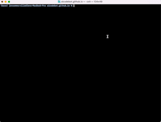

---

title: Testing Markdown
layout: default
---
# AICodeBot: Your AI-Powered Coding Companion

An AI-driven pair programmer that’s there for you 24/7. AICodeBot is the future of coding, making it faster, more intuitive, and fun. Don’t just take our word for it; experiment with AICodeBot to witness the difference. Find out more <a href="https://novara-ai.github.io/aicodebot.github.io/about/"> about AICodeBot</a>.

_It's always free for public repos_

    

## Features

* **AI-Powered Pair Programmer**: Collaborate with a helpful AI sidekick to achieve an enhanced coding experience.
* **Instant Commit Messages**: Curate commit messages that narrate your code’s story like never before.
* **Innovative Brainstorming**: Harness the power of AI to brainstorm and develop groundbreaking features.
* **Speedy Code Reviews<** Get instantaneous feedback to elevate your code’s quality.
* **Effortless Debugging**: Discover and eliminate bugs at lightning speed.<

# Collaborate and Contribute

The brilliance of AICodeBot flourishes through the collaboration of ingenious minds like yours. We welcome developers passionate about revolutionizing coding experiences. Leave your mark by contributing to our open-source GitHub project. 

<a href="https://github.com/gorillamania/AICodeBot" target="_blank">Join us</a> in the quest to build the ultimate AI team member!
